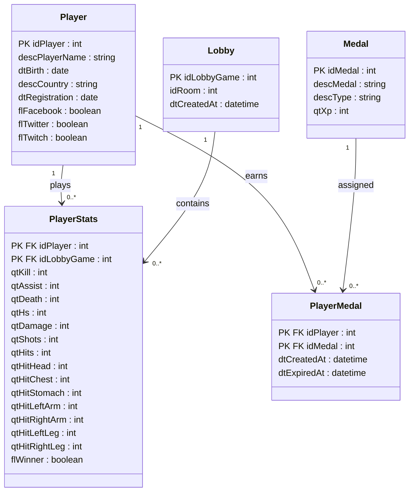

# Atelier_entrepot_de_donnee_epsi

## Noms de l'équipe
Amel Mansouris  
Maxence Etem  
Nagege Matezer  
Rémi Lhuissier  

## Présentation du Dataset

Nous avons choisi d'utiliser

Lien du dataset : https://www.kaggle.com/datasets/gamersclub/brazilian-csgo-plataform-dataset-by-gamers-club 
